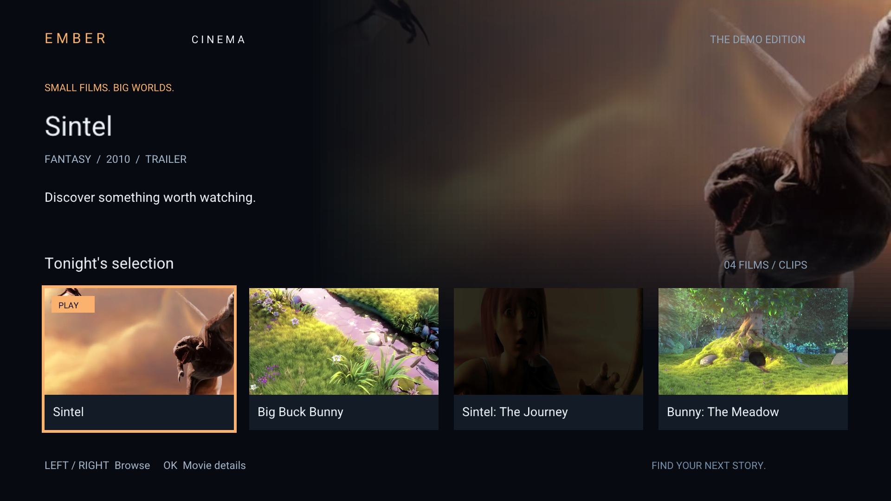

# Ember Cinema

A native Fire TV streaming demo. All authored application code is C: home screen, movie details, D-pad navigation, OpenGL rendering, player controls and lifecycle management. There are no Java, Kotlin, C++, JavaScript or WebView application sources. C calls Android's built-in MediaPlayer and SurfaceTexture through JNI for hardware-assisted decoding and audio. XML supplies Android packaging metadata; Bash builds the APK; Python drives emulator tests.



## Run on Fire TV

Supports **Fire OS 7 and newer Android-based Fire TV devices**, ARMv7 and ARM64. Requires Android API 26+ to use accurate seeking. This APK does not run on Vega OS devices.

Build the source using the instructions below to produce `dist/ember-cinema.apk`, a debug-signed APK.

Enable ADB debugging on the Fire TV, connect from a computer on the same network, then:

```sh
adb connect FIRE_TV_IP:5555
adb install -r dist/ember-cinema.apk
adb shell am start -n tv.cinema.nativeapp/android.app.NativeActivity
```

When an emulator is also attached, use `adb -s FIRE_TV_IP:5555` for install/start. The TV launcher lists the app as **Ember Cinema**.

## Remote controls

| Screen | Input | Action |
| --- | --- | --- |
| Home | Left / Right | Browse four movie tiles; wraps at either end |
| Home | Select / Enter | Open the selected movie's details |
| Details | Select / Enter | Stream the demo |
| Player | Any navigation key when hidden | Reveal the controls |
| Player | Left / Right | Choose rewind, play/pause or forward |
| Player | Select / Enter | Activate the focused control |
| Player | Play/Pause button | Toggle playback immediately |
| Player | Fast-forward / Rewind buttons | Seek forward/back by 10 seconds |
| Any screen | Back | Player → details → home → exit |

Controls disappear after four seconds without input, including when paused. Completion shows a Replay button. Home/backgrounding releases playback and returns to details. Loading runs on a worker so Back stays responsive. Failed connections show a retry explanation; return to details and select Play again. Pending connection cleanup must finish before another stream starts.

## Demo catalog

The four tiles use two real HTTPS demo streams, **Sintel** and **Big Buck Bunny**, hosted by W3C (Sintel trailer) and Test Videos (a silent, 10-second Bunny preview). Two collection tiles deliberately reuse those streams, as their descriptions state. There is no backend or subscription requirement. Poster stills are bundled; playback requires internet access. Change the `movies` array in `src/main.c` to use your own metadata, JPEG posters and HTTPS MP4 URLs.

The sample is not a DRM/subscription service: authentication, payments, subtitles and adaptive bitrate playback are not implemented.

## Build

Install Android SDK Platform 34, Build Tools 35.0.0, NDK 27.1.12297006 and JDK 17+. No Gradle or Android Studio project is required.

```sh
export ANDROID_HOME="$HOME/Library/Android/sdk" # use your SDK path
./scripts/build.sh
```

`ANDROID_NDK_HOME` can override the NDK path. The script compiles C with the NDK, packages the manifest/assets with aapt, aligns and signs the APK. Its local debug key is generated under `build/`, which is ignored. Use a separate release key for distribution. The APK contains both ARM architectures and 16 KB-aligned native library segments.

## Verification

With one attached Android TV emulator or device:

```sh
adb install -r dist/ember-cinema.apk
python3 tests/tv_smoke.py
```

The runtime test exercises actual remote input, both network streams, all movie detail routes, stable pause, auto-hide/reveal, on-screen and physical remote seeking, playback completion/replay, background/resume, and Back during preparation. It writes screenshots and logs to `artifacts/`. Its initial screenshot assertion targets a 1080p TV; adapt that assertion for another resolution.

Small C state tests can run on a host C compiler:

```sh
cc -std=c11 -Isrc tests/model_test.c -o /tmp/ember-model-test
/tmp/ember-model-test
```

The C state tests were also cross-compiled with the NDK and executed on the emulator.

Validation uses the Android TV API 34 ARM64 emulator at 1920×1080. A physical Fire TV is not connected, so real-device compatibility, audio output and remote behavior still deserve a hardware acceptance pass. The ARMv7 binary is built but has not been run on ARMv7 hardware.

## Implementation

- `src/main.c`: native activity, JNI player, GL UI, catalog and remote input.
- `src/model.h`: focus, control timeout and seek clamping.
- `assets/`: four JPEG movie stills.
- `vendor/`: stb image decoding and TrueType rasterization, with embedded licenses.
- `AndroidManifest.xml`: TV launcher entry, network permission, no touchscreen requirement.
- `scripts/build.sh`: reproducible native APK build.
- `tests/`: state assertions and device integration test.

The app uses the device's Roboto font with Noto Sans fallback. See `THIRD_PARTY.md` for media and library attribution.
